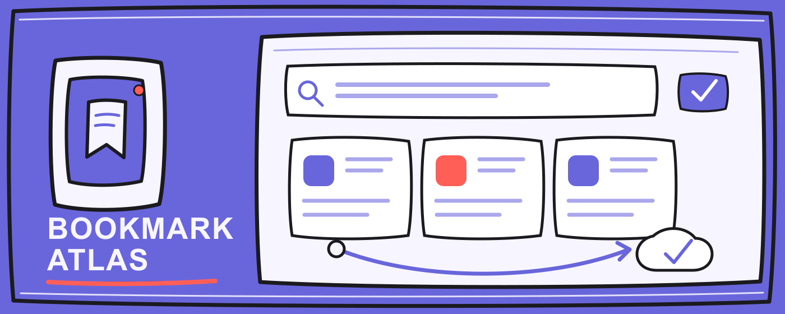

# Bookmark Atlas

Bookmark Atlas is a local-first Chrome new tab extension that combines Chrome
bookmarks, search, persistent web embeds, and a full Excalidraw canvas.

[Install from Chrome Web Store](https://chromewebstore.google.com/detail/bookmark-atlas/bkdplfepaegfdabniedlkaodllnmnbfl)
· [Changelog](CHANGELOG.md)
· [Support](SUPPORT.md)
· [Report a bug](https://github.com/xixi-kitchen/bookmark-atlas/issues/new/choose)



简体中文说明见本文件下方的「中文说明」。

## Features

- Manifest V3 new tab override.
- Reads and manages the current Chrome profile's native bookmark tree.
- Supports creating, editing, moving, sorting, deleting, and timed undo for
  bookmark changes.
- Keeps Excalidraw's native drawing, text, image, frame, link, undo/redo,
  import/export, zoom, and collaboration UI.
- Saves the full canvas and binary attachments to local IndexedDB, with
  `chrome.storage.local` as a fallback.
- Writes lightweight canvas state to Chrome Sync when quota allows: shapes,
  text, bookmark references, viewport, and library items are compressed and
  chunked. Images and binary attachments remain local to the device where they
  were added.
- Chrome Sync updates are event-driven and near real time when Chrome sync is
  available, but Chrome does not guarantee an exact delivery latency across
  devices or open tabs.
- Reconciles synced bookmark cards by normalized URL, title, and folder path
  instead of treating Chrome's profile-local bookmark IDs as cross-device keys.
- Shows Chrome bookmark folders in list and Excalidraw views, with folder
  navigation, breadcrumbs, group import, drag sorting, cross-folder movement,
  and precise same-folder ordering.
- Lets the search box show remote suggestions for supported built-in engines
  plus local results from open tabs, browsing history, and Chrome bookmarks.
- Follows the current Chrome default search service by default. Users may
  switch to Baidu, Bing, Google, or a safe custom search template.
- Uses Chrome's local favicon cache for bookmark cards and search engines, with
  text fallbacks when an icon is unavailable.
- Allows HTTPS web embeds and local development URLs. Custom iframes are
  sandboxed so embedded pages cannot navigate the extension's top-level page or
  escape through popups.
- Converts YouTube watch, Shorts, live, and playlist URLs into official iframe
  players when possible.
- Shows Bilibili home and regular pages directly. Bilibili video URLs are
  converted to the official player with autoplay disabled, and can be switched
  to a protected full video page from the embed toolbar.
- Gives new installs an optional three-step guide inside the real workspace;
  the fixed-width Help menu can replay it and show the current release notes.
- Includes Swiss, Bauhaus, Surreal, Memphis, Pop, and Pixel visual themes.

## Local Development

```bash
npm install
npm run dev
```

## Verification and Build

```bash
npm run check
npm run check:edge
npm run check:safari
```

The unpacked extension build is written to the visible directory
`output/chrome-mv3/`. In `chrome://extensions`, enable Developer mode, choose
"Load unpacked", and select that directory.

- `output/edge-mv3/` is an Edge compatibility candidate. It is not advertised
  as supported until real sideload and same-account two-device testing pass.
- `output/safari-mv3/` proves the WebExtension can be built, not that it is
  ready for Safari distribution. Safari still requires Apple packaging,
  runtime API testing, and a separate iCloud/CloudKit design for Safari-to-Safari
  canvas synchronization.
- Bookmark Atlas does not synchronize data between different browser families.

## Permissions

- `bookmarks`: display and manage Chrome bookmarks that the user acts on.
- `favicon`: read website icons from Chrome's local favicon cache.
- `storage`: save settings, local fallback canvas data, and lightweight synced
  canvas state.
- `search`: use the user's current Chrome search service without changing the
  browser's default search settings.
- `tabs`: match and switch open tabs in the pre-search panel.
- `history`: match browsing history in the pre-search panel.
- `declarativeNetRequestWithHostAccess` and the exact YouTube host permission:
  add a fixed Bookmark Atlas client referrer only to official YouTube `/embed/`
  player requests created by the extension.
- Exact host permissions for Baidu, Bing, and Google suggestion endpoints:
  fetch remote suggestions only when the user selects the corresponding built-in
  search engine.

Web embeds still follow each website's own iframe policy. If a site blocks
embedding with `X-Frame-Options` or CSP `frame-ancestors`, the browser will
block display; an extension cannot override that safely.

Bookmark Atlas does not read page content, request arbitrary website access,
sell user data, include ads or trackers, or execute remote code.

## 中文说明

Bookmark Atlas 是一个本地优先的 Chrome 新标签页扩展，把 Chrome 书签、
搜索、网页嵌入和完整 Excalidraw 画布放在同一个工作空间里。

[从 Chrome 应用商店安装](https://chromewebstore.google.com/detail/bookmark-atlas/bkdplfepaegfdabniedlkaodllnmnbfl)
· [更新日志](CHANGELOG.md)
· [获取帮助](SUPPORT.md)
· [反馈问题](https://github.com/xixi-kitchen/bookmark-atlas/issues/new/choose)

主要能力：

- 读取并管理当前 Chrome 配置文件的原生书签树。
- 在列表视图和 Excalidraw 画布中查看、导入、移动、排序和打开书签。
- 保留完整 Excalidraw 绘图体验，包括文字、图片、框架、链接、导入导出和撤销重做。
- 完整画布和附件保存在当前设备；图形、文字、书签引用、视口和素材库在配额允许时写入 Chrome Sync。
- Chrome Sync 是事件驱动的近实时同步，但 Chrome 不承诺跨设备或多标签页的固定到达时间；图片和二进制附件只保存在添加它们的设备上。
- 搜索框可以同时显示远程联想、已打开标签页、浏览历史和 Chrome 书签。
- 普通 HTTPS 网页可以嵌入画布；iframe 会被限制，不能覆盖跳转插件页面。YouTube 和 Bilibili 视频使用官方播放器，Bilibili 视频默认关闭自动播放。
- 首次安装会显示可跳过的三步真实界面引导；固定宽度帮助菜单可随时重播引导并查看版本更新。

构建产物在可见目录 `output/chrome-mv3/`，可在 Chrome 扩展管理页面中作为未打包扩展加载。

Edge 构建目前是兼容性候选，在完成真实侧载和同账号双设备测试前不会对外宣称正式支持。Safari 当前只完成 WebExtension 构建可行性验证；它仍需要 Apple 打包、Safari API 实测，以及单独的 iCloud/CloudKit 同浏览器同步方案。Bookmark Atlas 不会在不同浏览器之间同步数据。
